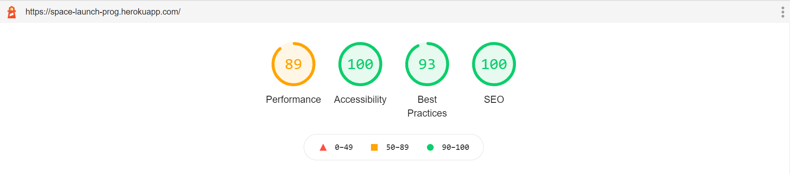

# SpaceX Launch Program

## About Project

This project is built with:

- react
- redux

This project is enabled with server side rendering of react js with the help of express js.

## Approach/Feature in Project

- Usage of redux.
- Common components are placed seperately in subfolder. Filter is considered as common component as it can be used in another component also.
- Lazy Loading of images
- Memoization of component.

## Run Project

To run this project with Client Side Rendering use:

- npm install
- npm start

To run this project with Server Side Rendering use:

- npm run build:ssr
- npm run start:ssr

## Deployment

This project has been deployed on **heroku**. To visit use (https://space-launch-prog.herokuapp.com/). **CircleCi** pipeline has been used for CI.

## LightHouse Report

